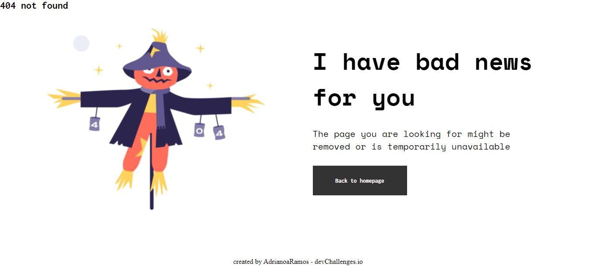

<!-- Please update value in the {}  -->

<h1 align="center">404-not-found</h1>

   Solution for a challenge from  <a href="http://devchallenges.io" target="_blank">Devchallenges.io</a>.

<!-- TABLE OF CONTENTS -->

## Índice

- [Prévia](#prévia)
- [Ferramentas](#ferramentas)
- [Recursos](#recursos)
- [Contato](#contato)

<!-- OVERVIEW -->

## Prévia

### Ferramentas

<!-- This section should list any major frameworks that you built your project using. Here are a few examples.-->

- [HTML5](https://developer.mozilla.org/pt-BR/docs/Web/HTML)
- [CSS](https://developer.mozilla.org/pt-BR/docs/Web/CSS)

## Recursos

<!-- List the features of your application or follow the template. Don't share the figma file here :) -->

Este site foi criado como um envio para um desafio [DevChallenges](https://devchallenges.io/challenges). O [Desafio](https://devchallenges.io/challenges/wBunSb7FPrIepJZAg0sY) era construir uma pagina para completar as histórias de usuário fornecidas..

## Contato

- GitHub [@AdrianoaRamos](https://github.com/AdrianoaRamos)

